  

  
  
  

  

 

## About Me

I'm **Mayank Agrawal**, founder of **ZethraOS**, an AI-native operating system built for every screen: mobile, laptop, tablet, TV, and wearables. I build systems that run AI locally, privately, and at scale, without cloud dependency.

- Currently building **ZethraOS**, with **ZethraAI**, an autonomous self-healing engine that collapses the exploit window from days to seconds
- Creator of **cursor-lite**, a fully local multi-model AI coding agent (Qwen2.5-Coder, Qwen3.5, LLaMA3.2) with zero cloud APIs
- Rust-first systems thinker, Node.js backend engineer by trade
- Based in Bengaluru, India
- Fun fact: I used AI to help build an AI operating system. I architected every system, wrote every prompt, and reviewed every plan.

 

## What I'm Building

<table>
<tr>
<td width="50%" valign="top">

### ZethraOS
**The AI-Native OS for Every Screen**

Next-gen operating system on Rust and Linux 7.1. Core engine **ZethraAI** autonomously monitors device health, correlates crash data across the device graph, and generates cryptographically signed micro-patches, collapsing the exploit window from days to seconds.

`Rust` `Linux Kernel` `On-Device AI` `Memory Safety` `Apache 2.0`

[Website](https://zethraos.com) &nbsp;&middot;&nbsp; [GitHub Org](https://github.com/ZethraOS)

</td>
<td width="50%" valign="top">

### cursor-lite
**Local Multi-Model AI Coding Agent**

Fully local coding assistant on Qwen2.5-Coder, Qwen3.5, and LLaMA3.2. Custom orchestration layer, stateful tool safety system, and a ChatGPT-style streaming UI. Zero cloud APIs, zero external costs.

`Node.js` `LLM Orchestration` `Agentic AI` `Prompt Engineering`

[Demo on LinkedIn](https://www.linkedin.com/in/er-mayank)

</td>
</tr>
</table>

 

## Tech Stack

**Languages and Runtime**
 

**Backend and Frameworks**
 

**Frontend**
 

**Cloud and DevOps**
 

**Databases**
 

**AI and LLM**
 

 

## GitHub Stats

  
  

  

  

 

## Contribution Snake

  

Set up takes two minutes. See the setup notes shared alongside this file.

 

## Featured Repositories

| Project | Description | Stack |
|---|---|---|
| [JavaSpringBoot-ReactJS-TailwindCSS](https://github.com/er-mayanka/JavaSpringBoot-ReactJS-TailwindCSS) | Grant management system for nonprofits. Java 17 and Spring Boot backend, React and Tailwind frontend | `Java` `Spring Boot` `React` |
| [Influencer-Tracker](https://github.com/er-mayanka/Influencer-Tracker) | Scalable dashboard distributing workload across worker instances for influencer data tracking | `Node.js` `Scalable Architecture` |
| [onedrive-poc](https://github.com/er-mayanka/onedrive-poc) | OAuth2-secured OneDrive file access manager with real-time permission tracking | `Express.js` `OAuth2` |
| [Drone-Simulator-with-Angular-v16](https://github.com/er-mayanka/Drone-Simulator-with-Angular-v16) | Real-time drone motion simulation on Google Maps | `Angular` `Maps API` |
| [Virtual-Wallet](https://github.com/er-mayanka/Virtual-Wallet) | Digital wallet with credit and debit ledger, exportable transaction history | `TypeScript` |
| [Inventory-Management](https://github.com/er-mayanka/Inventory-Management) | Inventory tracking system | `TypeScript` |

Once your ZethraOS and cursor-lite repositories are public, pin those first. They are the strongest signal of what you are building right now.

 

## Connect With Me

  
  
  
  

  

  

